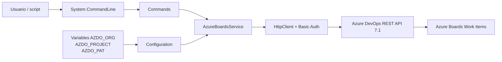
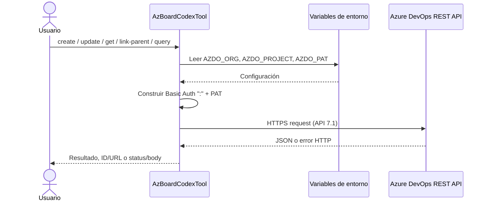
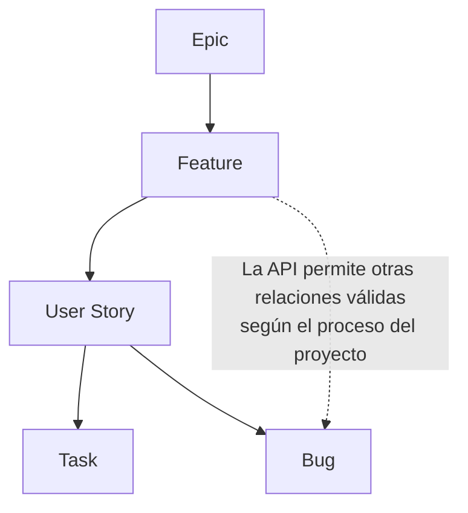

# AzBoardCodexTool

CLI en .NET 8 para crear, actualizar, consultar y relacionar Work Items en Azure Boards mediante la API REST oficial.

La herramienta consulta los tipos habilitados en el proyecto antes de crear. Funciona con
procesos Basic, Agile, Scrum, CMMI y procesos heredados con tipos personalizados. Reconoce
directamente estos tipos comunes:

- Epic
- Feature
- User Story
- Issue
- Product Backlog Item
- Requirement
- Task
- Bug
- Impediment
- Test Case

## Requisitos

- .NET SDK 8 o superior.
- Un PAT de Azure DevOps con permisos de **Work Items: Read & write**.
- Las variables de entorno `AZDO_ORG`, `AZDO_PROJECT` y `AZDO_PAT`.

La aplicación valida las tres variables al iniciar y nunca almacena ni imprime el PAT.

## Configuración

PowerShell, para la sesión actual:

```powershell
$env:AZDO_ORG = "mi-organizacion"
$env:AZDO_PROJECT = "mi-proyecto"
$env:AZDO_PAT = "mi-pat"
```

Para persistirlas para el usuario:

```powershell
[Environment]::SetEnvironmentVariable("AZDO_ORG", "mi-organizacion", "User")
[Environment]::SetEnvironmentVariable("AZDO_PROJECT", "mi-proyecto", "User")
[Environment]::SetEnvironmentVariable("AZDO_PAT", "mi-pat", "User")
```

Abra una terminal nueva después de persistirlas. `.env.example` es solo una referencia; el programa no carga archivos `.env`.

## Compilar y ejecutar

```powershell
dotnet restore
dotnet build --configuration Release
dotnet test .\tests\AzBoardCodexTool.Tests\AzBoardCodexTool.Tests.csproj --configuration Release
dotnet run -- --help
```

La URL base usada por el cliente es:

```text
https://dev.azure.com/{AZDO_ORG}/{AZDO_PROJECT}
```

El PAT se envía por HTTPS mediante Basic Auth, con username vacío y el PAT como password.

## Script de invocación

El wrapper `scripts/Invoke-AzBoardCodexTool.ps1` valida `AZDO_ORG`, `AZDO_PROJECT` y `AZDO_PAT` antes de llamar a la herramienta. Busca primero en el proceso actual y después en las variables persistentes de usuario y máquina. Nunca imprime el PAT.

Validar únicamente la configuración:

```powershell
.\scripts\Invoke-AzBoardCodexTool.ps1 -CheckEnvironment
```

Listar los tipos habilitados en el proyecto sin realizar cambios:

```powershell
.\scripts\Invoke-AzBoardCodexTool.ps1 -Command types
```

Crear un Work Item usando .NET:

```powershell
.\scripts\Invoke-AzBoardCodexTool.ps1 `
  -Command create `
  -Type "User Story" `
  -Title "Crear pantalla de login" `
  -Description "Crear pantalla de login para la app móvil" `
  -AssignedTo "desarrollador@empresa.com" `
  -AcceptanceCriteria "El usuario puede iniciar sesión con credenciales válidas." `
  -Attachment ".\docs\login-wireframe.png" `
  -Tags "MVP;Auth;Mobile" `
  -Comment "Creado desde Codex."
```

Usar la imagen Docker:

```powershell
.\scripts\Invoke-AzBoardCodexTool.ps1 `
  -Runtime Docker `
  -Command get `
  -Id 12345
```

Comandos admitidos por el script: `create`, `update`, `get`, `link-parent`, `query`, `types` y `help`.

## Uso con Docker

### Construir la imagen

Desde la raíz del proyecto:

```powershell
docker build --tag az-board-codex-tool:latest .
```

La imagen usa una compilación multi-stage: compila con el SDK de .NET 8 y ejecuta únicamente sobre el runtime de .NET 8.

### Proporcionar la configuración

Si las variables ya existen en la sesión de PowerShell, Docker puede heredarlas por nombre:

```powershell
docker run --rm `
  --env AZDO_ORG `
  --env AZDO_PROJECT `
  --env AZDO_PAT `
  az-board-codex-tool:latest --help
```

También puede crear un archivo local `.env` a partir de `.env.example`:

```powershell
Copy-Item .env.example .env
```

Después de completar sus valores, úselo así:

```powershell
docker run --rm `
  --env-file .env `
  az-board-codex-tool:latest --help
```

`.env` está excluido tanto de Git como del contexto de construcción de Docker.

### Crear un Work Item

```powershell
docker run --rm `
  --env-file .env `
  az-board-codex-tool:latest create `
  --type "User Story" `
  --title "Crear pantalla de login" `
  --description "Crear pantalla de login para la app móvil" `
  --assigned-to "desarrollador@empresa.com" `
  --acceptance-criteria "El usuario puede iniciar sesión con credenciales válidas." `
  --attachment ".\docs\login-wireframe.png" `
  --tags "MVP;Auth;Mobile" `
  --comment "Creado desde Codex."
```

### Actualizar un Work Item

```powershell
docker run --rm `
  --env-file .env `
  az-board-codex-tool:latest update `
  --id 12345 `
  --title "Actualizar pantalla de login" `
  --assigned-to "desarrollador@empresa.com" `
  --acceptance-criteria "El login muestra errores claros para credenciales inválidas." `
  --state "Active" `
  --attachment ".\docs\login-errors.png" `
  --comment "Se inicio el desarrollo."
```

### Consultar por ID

```powershell
docker run --rm `
  --env-file .env `
  az-board-codex-tool:latest get --id 12345
```

### Relacionar hijo con padre

```powershell
docker run --rm `
  --env-file .env `
  az-board-codex-tool:latest link-parent `
  --child-id 12346 `
  --parent-id 12345
```

### Consultar con WIQL

```powershell
docker run --rm `
  --env-file .env `
  az-board-codex-tool:latest query `
  --wiql "SELECT [System.Id], [System.Title], [System.State] FROM WorkItems WHERE [System.TeamProject] = @project ORDER BY [System.ChangedDate] DESC"
```

Los argumentos colocados después del nombre de la imagen se envían directamente al CLI porque el contenedor define `AzBoardCodexTool.dll` como su `ENTRYPOINT`.

## Comandos

### Crear un Work Item

```powershell
dotnet run -- create `
  --type Task `
  --title "Crear pantalla de login" `
  --description "Crear pantalla de login para la app móvil" `
  --assigned-to "desarrollador@empresa.com" `
  --acceptance-criteria "El usuario puede iniciar sesión con credenciales válidas." `
  --tags "MVP;Auth;Mobile" `
  --comment "Creado desde Codex."
```

`--type` acepta cualquier tipo que Azure DevOps exponga para el proyecto configurado. Se
normalizan los alias `UserStory`, `Story`, `ProductBacklogItem`, `PBI` y `TestCase`. Antes de
crear, la herramienta valida que el tipo y los campos opcionales existan en el proyecto.

Opciones adicionales:

- `--assigned-to`: nombre visible, correo o identidad reconocida por Azure DevOps.
- `--acceptance-criteria`: contenido de `Microsoft.VSTS.Common.AcceptanceCriteria`.
- `--priority`: contenido de `Microsoft.VSTS.Common.Priority`.
- `--steps-file`: archivo JSON con pasos; solo puede usarse con `Test Case`.
- `--comment`: comentario inicial agregado despues de crear el Work Item.
- `--attachment`: ruta de archivo local para adjuntar. Puede repetirse para subir varios archivos.

Estas opciones son opcionales. Si un campo no existe para el tipo seleccionado, la herramienta
detiene la operación antes de crear el Work Item e informa el campo incompatible.

### Crear un Test Case con pasos

Crear `test-case-steps.json`:

```json
[
  {
    "action": "Abrir la pantalla de inicio de sesión",
    "expectedResult": "Se muestran los campos de usuario y contraseña"
  },
  {
    "action": "Ingresar credenciales válidas y continuar",
    "expectedResult": "Se muestra el dashboard"
  }
]
```

Ejecutar:

```powershell
.\scripts\Invoke-AzBoardCodexTool.ps1 `
  -Command create `
  -Type "Test Case" `
  -Title "Inicio de sesión exitoso" `
  -StepsFile ".\test-case-steps.json" `
  -Priority 2
```

### Listar tipos disponibles

```powershell
dotnet run -- types
```

Este comando permite verificar los tipos de un proyecto Basic, Agile, Scrum, CMMI o
personalizado sin crear ni modificar Work Items.

### Actualizar un Work Item

```powershell
dotnet run -- update `
  --id 12345 `
  --title "Actualizar pantalla de login" `
  --description "Nueva descripción" `
  --assigned-to "desarrollador@empresa.com" `
  --acceptance-criteria "El usuario puede iniciar sesión y recibe mensajes de error claros." `
  --state "Active" `
  --attachment ".\docs\login-evidence.png" `
  --comment "Se actualizo el alcance."
```

Se debe enviar al menos una de estas opciones: `--title`, `--description`, `--assigned-to`, `--acceptance-criteria`, `--state`, `--tags`, `--comment` o `--attachment`.

`--attachment` sube primero el archivo local a Azure DevOps y luego lo relaciona con el Work Item como `AttachedFile`. Puede repetirse:

```powershell
dotnet run -- update `
  --id 12345 `
  --attachment ".\docs\evidencia-1.png" `
  --attachment ".\docs\evidencia-2.pdf"
```

## Ejecucion paralela

La herramienta procesa una operacion por invocacion del CLI. No incluye un comando batch interno para crear o actualizar varios Work Items dentro del mismo proceso.

Para ejecutar varios trabajos en paralelo, lance varias invocaciones independientes del wrapper. Cada proceso crea su propio `HttpClient`, lee la configuracion desde variables de entorno y no comparte archivos temporales ni estado mutable con otras ejecuciones.

Ejemplo con PowerShell:

```powershell
$jobs = @(
    @{
        Type = "Task"
        Title = "Crear validacion de login"
        Comment = "Creado en ejecucion paralela."
    },
    @{
        Type = "Task"
        Title = "Agregar logs de autenticacion"
        Comment = "Creado en ejecucion paralela."
    },
    @{
        Type = "Bug"
        Title = "Corregir error de sesion expirada"
        Comment = "Creado en ejecucion paralela."
    }
) | ForEach-Object {
    Start-Job -ScriptBlock {
        param($Item)

        .\scripts\Invoke-AzBoardCodexTool.ps1 `
          -Command create `
          -Type $Item.Type `
          -Title $Item.Title `
          -Comment $Item.Comment
    } -ArgumentList $_
}

$jobs | Wait-Job | Receive-Job
$jobs | Remove-Job
```

El paralelismo efectivo queda limitado por Azure DevOps, la red y las politicas de rate limiting del proyecto u organizacion. Si Azure DevOps devuelve respuestas temporales por exceso de solicitudes, reduzca la cantidad de jobs simultaneos o agregue reintentos en el orquestador externo.

### Consultar por ID

```powershell
dotnet run -- get --id 12345
```

Devuelve JSON e incluye las relaciones del Work Item.

### Relacionar hijo con padre

```powershell
dotnet run -- link-parent `
  --child-id 12346 `
  --parent-id 12345
```

La relación se agrega al hijo como `System.LinkTypes.Hierarchy-Reverse`.

### Consultar con WIQL

```powershell
dotnet run -- query `
  --wiql "SELECT [System.Id], [System.Title], [System.State] FROM WorkItems WHERE [System.TeamProject] = @project ORDER BY [System.ChangedDate] DESC"
```

El comando ejecuta WIQL y obtiene los detalles en lotes de hasta 200 IDs. Muestra ID, tipo, estado y título.

## Publicar como herramienta ejecutable

Publicación portable:

```powershell
dotnet publish --configuration Release --output .\publish
.\publish\AzBoardCodexTool.exe --help
```

También puede ejecutarse directamente:

```powershell
dotnet .\publish\AzBoardCodexTool.dll get --id 12345
```

## Manejo de errores

Cuando Azure DevOps responde con error, la herramienta muestra:

- Código y nombre del status HTTP.
- URL solicitada.
- Body completo de la respuesta.

Los errores de configuración y validación se escriben en `stderr`.

## Arquitectura e integración



### Flujo de una operación



### Jerarquía de Work Items



`link-parent` no impone una jerarquía de tipos en el cliente: Azure Boards valida si la relación es válida para el proceso configurado en el proyecto.

## Estructura

```text
AzBoardCodexTool/
├── Commands/
│   ├── ConsoleOutput.cs
│   └── WorkItemCommands.cs
├── Configuration/
│   ├── AzureDevOpsOptions.cs
│   └── ConfigurationException.cs
├── Models/
│   ├── JsonPatchOperation.cs
│   ├── TestCaseStep.cs
│   ├── WiqlModels.cs
│   ├── WorkItem.cs
│   └── WorkItemTypeModels.cs
├── Services/
│   ├── AzureBoardsService.cs
│   ├── AzureDevOpsApiException.cs
│   ├── TestCaseStepsSerializer.cs
│   └── WorkItemTypeName.cs
├── scripts/
│   └── Invoke-AzBoardCodexTool.ps1
├── tests/
│   └── AzBoardCodexTool.Tests/
│       ├── AzBoardCodexTool.Tests.csproj
│       ├── AzureBoardsServiceTests.cs
│       ├── GlobalUsings.cs
│       ├── TestCaseStepsSerializerTests.cs
│       └── WorkItemTypeNameTests.cs
├── .env.example
├── .dockerignore
├── .gitignore
├── AzBoardCodexTool.csproj
├── Dockerfile
├── Program.cs
└── README.md
```

## Referencias oficiales

- [Work Items - Create](https://learn.microsoft.com/en-us/rest/api/azure/devops/wit/work-items/create?view=azure-devops-rest-7.1)
- [Work Item Types - List](https://learn.microsoft.com/en-us/rest/api/azure/devops/wit/work-item-types/list?view=azure-devops-rest-7.1)
- [Work Item Type Fields - List](https://learn.microsoft.com/en-us/rest/api/azure/devops/wit/work-item-types-field/list?view=azure-devops-rest-7.1)
- [Work Items - Update](https://learn.microsoft.com/en-us/rest/api/azure/devops/wit/work-items/update?view=azure-devops-rest-7.1)
- [Work Items - Get](https://learn.microsoft.com/en-us/rest/api/azure/devops/wit/work-items/get?view=azure-devops-rest-7.1)
- [WIQL - Query By WIQL](https://learn.microsoft.com/en-us/rest/api/azure/devops/wit/wiql/query-by-wiql?view=azure-devops-rest-7.1)
- [Work Items - Get Work Items Batch](https://learn.microsoft.com/en-us/rest/api/azure/devops/wit/work-items/get-work-items-batch?view=azure-devops-rest-7.1)
- [Work Item Link Types](https://learn.microsoft.com/en-us/azure/devops/boards/queries/link-type-reference?view=azure-devops)
- [Azure DevOps authentication guidance](https://learn.microsoft.com/en-us/azure/devops/integrate/get-started/authentication/authentication-guidance?view=azure-devops)
- [System.CommandLine overview](https://learn.microsoft.com/en-us/dotnet/standard/commandline/)

## Seguridad

- No confirme `.env`, PATs, logs con headers de autorización ni archivos locales de configuración.
- Evite escribir el PAT directamente en el comando `docker run`; prefiera variables heredadas, `--env-file` o el mecanismo de secretos de su plataforma.
- Use el mínimo scope necesario para el PAT.
- Rote el PAT de acuerdo con las políticas de su organización.
- Para automatizaciones de largo plazo, Microsoft recomienda considerar Microsoft Entra ID en lugar de PATs.
